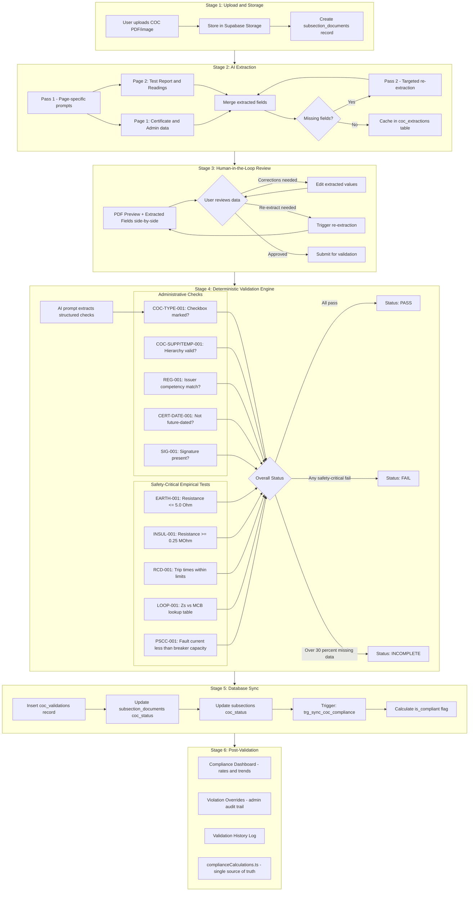

# 📋 COC Review Process — Complete Technical Reference

> ⛔ **OBSOLETE 2026-06-12 — the automated COC review/validation pipeline described here was REMOVED.** `validate-coc`/`extract-coc`, the validation tables, and the review/approval UI no longer exist. COC is now a **manual** Pass/Fail verdict per subsection (+ failure report) that gates `is_compliant`. Current docs: `docs/superpowers/COC-VALIDATION-STRIPOUT-TRACKER.md`. Kept for historical reference only.

> **Single source of truth** for the Certificate of Compliance (COC) review pipeline in `wm-compliance`.
> Based on SANS 10142-1:2020 (Wiring of Premises).

---

## 📐 System Architecture

### Visual Process Flow



### Architecture Summary

```
Key Principle: AI EXTRACTS --> Human REVIEWS --> Server DECIDES
```

### Technology Stack

| Component | Technology |
|-----------|-----------|
| AI Extraction | Google Gemini `gemini-2.5-flash` |
| AI Validation Prompt | Google Gemini `gemini-2.5-flash` (configurable via `coc_validation_settings.ai_model`) |
| Edge Functions | Supabase Deno Edge Functions |
| Database | Supabase PostgreSQL |
| Storage | Supabase Storage (`documents` bucket) |
| Frontend | React 18 + TypeScript + Shadcn/UI |
| PDF Preview | Native browser PDF rendering |

---

## 📁 Stage 1: Document Upload & Storage

### Storage Path Convention
```
documents/{subsectionId}/COC/{timestamp}-{filename}
```

### Database Tables

| Table | Purpose |
|-------|---------|
| `subsection_documents` | Tracks individual documents per subsection (file_url, category, coc_status) |
| `site_documents` | Site-level document tracking |
| `document_categories` | Organizes documents into categories per subsection |

### Upload Flow
1. User navigates to a subsection's **COC-Metering** tab
2. Uploads a PDF or image of the COC
3. File stored in Supabase Storage bucket
4. Record created in `subsection_documents` with `category = 'COC'`
5. User triggers "Review COC" to start extraction

---

## 🤖 Stage 2: AI Extraction (`extract-coc` Edge Function)

**File:** `supabase/functions/extract-coc/index.ts`

### Strategy: Two-Pass Extraction

```
Pass 1: Page-specific extraction (PAGE_1_PROMPT + PAGE_2_PROMPT)
   ├── Page 1: Certificate details, admin data, declarations
   └── Page 2: Test report, measurements, installation details

Pass 2: Targeted retry for missing fields (TARGETED_EXTRACTION_PROMPT)
   └── Only re-extracts fields that came back null/empty
```

### AI Model
- **Model:** `google/gemini-2.5-flash` (via Google AI Studio API)
- **Input:** PDF converted to base64-encoded pages
- **Temperature:** Controlled via settings (default: low for accuracy)

### Page 1 Extraction Fields (~30 fields)

| Field Group | Key Fields |
|-------------|-----------|
| **Certificate** | `cocNumber`, `cocType`, `cocIssueDate` |
| **Checkbox States** | `initialBoxMarked`, `supplementaryBoxMarked`, `temporaryBoxMarked`, `checkboxConfidence` |
| **Supplement Details** | `supplementNo`, `initialCertificateNo` (parent COC reference) |
| **Installation ID** | `physicalAddress`, `buildingName`, `gpsCoordinates`, `suburb`, `district`, `erfNumber` |
| **Registered Person** | `registeredPerson`, `idNumber`, `registrationNumber`, `registrationType`, `dateOfRegistration` |
| **Electrical Contractor** | `name`, `registrationNumber`, contact details |
| **Recipient** | `name`, `signatureDate` |

### Page 2 Extraction Fields (~30 fields)

| Field Group | Key Fields |
|-------------|-----------|
| **Test Report Header** | `issueDate`, `testReportFor`, `additionalPages` |
| **Installation Details** | `installationType`, `electricitySupplySystem`, `voltage`, `numberOfPhases`, `frequency` |
| **Main Switch** | `mainSwitchType`, `numberOfPoles`, `currentRating`, `shortCircuitRating`, `earthLeakageRating` |
| **Inspection Checks** | `conductorsCorrect`, `componentsCorrect`, `disconnectingDevicesCorrect`, `markingAndLabelling` |
| **Test Results** | `earthContinuityResistance`, `earthLoopImpedance`, `insulationResistance`, `prospectiveShortCircuitCurrent`, `rcdTripTimes`, `polarity`, `voltages` |
| **Responsibility** | `name`, `registrationCertNo`, `registrationType`, `signatureDate` |

### Checkbox Detection Logic (Critical)

The COC type checkbox is the **#1 extraction error**. The prompt enforces:

1. **Conservative detection** — if uncertain, report `"Not Marked"` (never default to Initial)
2. **Step-by-step analysis** — examine each checkbox individually
3. **Anti-hallucination rules** — empty box borders are NOT tick marks
4. **Confidence scoring** — `high` / `medium` / `low` per checkbox area

```
WHAT COUNTS AS MARKED:
✓ Tick/check mark    ✗ X mark    ■ Filled box    Handwritten mark INSIDE box

WHAT DOES NOT COUNT:
□ Empty box border    Smudges    Printing artifacts    Label text
```

### Date Normalization
- South African formats: `DD.MM.YYYY` → `YYYY-MM-DD`
- Slash formats: `DD/MM/YYYY` → `YYYY-MM-DD`

### Database: `coc_extractions`
Extracted data is cached in this table for re-use:
- `document_id` → links to `subsection_documents`
- `subsection_id` → links to `subsections`
- `extracted_data` → JSON blob of all extracted fields
- `confidence` → `high` / `medium` / `low`
- `extraction_method` → `gemini-2.5-flash`

---

## 👁️ Stage 3: Human-in-the-Loop Review

**File:** `src/components/COCPreviewApproval.tsx`

### UI Features
- **Split view:** PDF preview (left) + editable fields (right)
- **Field-by-field editing:** User can correct any extracted value
- **Missing field indicators:** Highlights fields that came back empty
- **Re-extraction:** Can re-extract a single field or all missing fields
- **Confidence badges:** Shows AI confidence per field group

### Review Workflow
```
1. User sees extracted data alongside the original PDF
2. User corrects any misread values (especially COC number, dates, test readings)
3. User clicks "Approve & Validate"
4. Approved data is sent to the deterministic validation engine
```

### COC Review Status Component
**File:** `src/components/COCReviewStatus.tsx`

Displays a summary card with:
- Extraction confidence badge
- Validation status badge (Pass/Fail)
- Key extracted data (COC number, type, date, registered person)
- Violation count with top-3 preview
- Action buttons: View Report, Edit Extraction, Re-extract, Re-validate, History

---

## ⚖️ Stage 4: Deterministic Validation Engine

**Files:**
- `supabase/functions/validate-coc/index.ts` — Deterministic engine
- `supabase/functions/validate-coc/prompt.ts` — AI prompt + settings types

### Core Principle
> **AI is the extractor. Server-side rules make pass/fail decisions.**

The AI prompt (Gemini) extracts structured data and performs initial checks. The **deterministic engine** then overrides AI decisions using mathematical rules.

### Configuration Source
Table: `coc_validation_settings` — all thresholds and toggles are configurable.

---

### 📏 Rule Reference

#### A. Administrative Checks

| Check ID | Rule | Condition | Auto-Fail |
|----------|------|-----------|-----------|
| `COC-TYPE-001` | COC type checkbox marked | At least one of Initial/Supplementary/Temporary must be ticked | Yes |
| `COC-SUPP-001` | Supplementary references Initial | Must include Initial COC number | Yes (configurable) |
| `COC-TEMP-001` | Temporary references Initial | Must include Initial COC number | Yes (configurable) |
| `REG-001` | Issuer competency | Single Phase tester cannot certify Three Phase installation | Yes |
| `CERT-DATE-001` | No future-dated certificates | Issue date must not be after today | Yes (configurable) |
| `SIG-001` | Signature present | Signature area must not be completely blank | Yes (configurable) |

**Initial COC Exception:** An Initial COC stands alone — `COC-SUPP-001` and `COC-TEMP-001` are `Not Applicable`.

**COCs DO NOT EXPIRE.** The system does not fail based on certificate age.

#### B. Safety-Critical Empirical Tests

These checks **reject text-based passes** (e.g., "OK", "Pass", "Satisfactory") — numeric measurements are legally required.

##### EARTH-001 — Earth Resistance (Clause 8.4)
```
Threshold: ≤ 5.0Ω (configurable via earth_continuity_max_ohms)
Accepts:   Numeric values, N/A, TEXT_PASS (exception — "Compliant"/"Pass" accepted)
Rejects:   Null/missing values
```

**Exception:** EARTH-001 is the **only empirical check** that accepts text-based pass values. This reflects common South African COC practice where earth resistance is sometimes recorded as "Compliant" or "Pass" by issuing electricians.

##### INSUL-001 — Insulation Resistance (Clause 8.6)
```
Threshold: ≥ 0.25 MΩ (configurable via insulation_resistance_min_mohms)
Accepts:   Numeric values ≥ threshold, ∞/OL/>500MΩ (automatic pass), N/A
Rejects:   TEXT_PASS ("OK"/"Pass" NOT legally acceptable)
Special:   AI "blank" readings may be misread ∞ symbols — downgraded to "Not Tested"
```

##### RCD-001 — RCD Trip Times (Clause 8.8)
```
Thresholds:
  @1× IΔn: ≤ 300ms (configurable via rcd_trip_1x_max_ms)
  @2× IΔn: ≤ 150ms (configurable via rcd_trip_max_ms)
  @5× IΔn: ≤ 40ms  (configurable via rcd_trip_5x_max_ms)
Accepts:   Numeric values in ms, N/A
Rejects:   TEXT_PASS (empirical measurement required)
```

##### LOOP-001 — Earth Loop Impedance Zs (Clause 8.5)
```
Validation: Measured Zs must be ≤ maximum Zs from lookup table
Accepts:    Numeric values in Ω, N/A
Rejects:    TEXT_PASS (empirical measurement required)
Requires:   MCB rating + MCB type for lookup
```

##### PSCC-001 — Prospective Short-Circuit Current (Clause 8.3)
```
Rule:       PSCC must be LESS THAN breaker breaking capacity
Accepts:    Numeric values in kA, N/A
Rejects:    TEXT_PASS (empirical measurement required)
Defaults:   6kA (domestic), 10kA (commercial) if breaker capacity not extracted
```

#### C. Zs Lookup Table (Type B MCB @ 0.4s disconnection)

| MCB Rating | Type B Max Zs (Ω) | Type C (×0.5) | Type D (×0.25) |
|------------|-------------------|---------------|----------------|
| 6A | 7.67 | 3.84 | 1.92 |
| 10A | 4.60 | 2.30 | 1.15 |
| 16A | 2.87 | 1.44 | 0.72 |
| 20A | 2.30 | 1.15 | 0.58 |
| 25A | 1.84 | 0.92 | 0.46 |
| 32A | 1.44 | 0.72 | 0.36 |
| 40A | 1.15 | 0.58 | 0.29 |
| 50A | 0.92 | 0.46 | 0.23 |
| 63A | 0.73 | 0.37 | 0.18 |

**Implementation:**
```typescript
const ZS_LOOKUP_TYPE_B: Record<number, number> = {
  6: 7.67, 10: 4.60, 16: 2.87, 20: 2.30,
  25: 1.84, 32: 1.44, 40: 1.15, 50: 0.92, 63: 0.73,
};

function getMaxZs(mcbRating: number, mcbType: string = 'B'): number | null {
  const baseZs = ZS_LOOKUP_TYPE_B[mcbRating];
  if (!baseZs) return null;
  if (mcbType === 'C') return baseZs * 0.5;
  if (mcbType === 'D') return baseZs * 0.25;
  return baseZs;
}
```

#### D. Value Parsing Logic

**Function:** `parseNumericValue(value: string): number | null | 'N/A' | 'TEXT_PASS'`

| Input Pattern | Parsed Result | Used For |
|---------------|--------------|----------|
| `"2.3"`, `"2,3"` | `2.3` (number) | SA comma-as-decimal support |
| `"n/a"`, `"not applicable"`, `"not tested"` | `'N/A'` | Non-applicable tests |
| `"compliant"`, `"pass"`, `"ok"`, `"✓"` | `'TEXT_PASS'` | Text-based pass values |
| `"∞"`, `"OL"`, `">500"`, `">500MΩ"` | `Infinity` | Insulation resistance auto-pass |
| `null`, `undefined`, unparseable | `null` | Missing data |

**TEXT_PASS values accepted:**
```
compliant, pass, passed, satisfactory, ok, good, acceptable,
correct, verified, confirmed, yes, tick, ticked, ✓, ✔,
within limits, within range, safe, adequate
```

**TEXT_PASS acceptance by check:**

| Check | TEXT_PASS Accepted? |
|-------|-------------------|
| EARTH-001 | ✅ Yes (SA practice) |
| POL-001 | ✅ Yes (non-empirical) |
| SIG-001 | ✅ Yes (non-empirical) |
| INSUL-001 | ❌ No — numeric required |
| RCD-001 | ❌ No — numeric required |
| LOOP-001 | ❌ No — numeric required |
| PSCC-001 | ❌ No — numeric required |

#### E. Overall Status Logic

```
PASS:
  ✅ All safety-critical checks pass
  ✅ COC hierarchy valid (type marked, references present)
  ✅ < mandatory_failures_for_fail mandatory failures (default: 2)

FAIL:
  ❌ ANY safety-critical failure (hasSafetyCriticalFail = true)
  ❌ COC hierarchy violation
  ❌ ≥ mandatory_failures_for_fail mandatory failures (default: 2)

INCOMPLETE:
  ⚠️ > 30% of mandatory test data missing
```

**Implementation (simplified):**
```typescript
// From applyDeterministicValidation()
if (hasSafetyCriticalFail) {
  overallStatus = 'Fail';
} else if (mandatoryFailCount >= settings.mandatory_failures_for_fail) {
  overallStatus = 'Fail';
} else {
  overallStatus = 'Pass';
}

// Incomplete sweep (CERT-INCOMPLETE-001)
const totalMandatory = deterministicChecks.filter(c =>
  !['Skipped', 'Not Applicable'].includes(c.result)
).length;
const notTested = deterministicChecks.filter(c => c.result === 'Not Tested').length;
if (totalMandatory > 0 && (notTested / totalMandatory) > 0.30) {
  overallStatus = 'Incomplete';
}
```

#### F. Non-Empirical Checks

| Check ID | Source | Behavior |
|----------|--------|----------|
| `POL-001` (Clause 8.7) | AI extraction | Polarity & continuity — trusts AI result (text-based check) |
| `SIG-001` | AI + Server | Only fails if AI says Fail AND measured value explicitly says blank/empty/missing |
| `CERT-DATE-001` | Server | Compares extracted issue date against today |
| `REG-001` | Server | Cross-references registration type against supply phases |

---

## 💾 Stage 5: Database Synchronization

### Tables Updated After Validation

#### `coc_validations`
```sql
INSERT INTO coc_validations (
  document_id,      -- links to subsection_documents
  subsection_id,    -- links to subsections
  status,           -- 'Pass' | 'Fail' | 'Incomplete'
  violations,       -- JSON array of criticalFailures
  report_data,      -- Full validation report (checks, settings, AI output)
  validated_at,     -- timestamp
  validated_by      -- user ID (nullable)
);
```

#### `subsection_documents`
```sql
UPDATE subsection_documents SET
  coc_status = 'Approved' | 'Failed' | 'Pending',
  coc_number = extracted_coc_number,
  coc_type = 'Initial' | 'Supplementary' | 'Temporary',
  coc_issue_date = extracted_date
WHERE id = document_id;
```

#### `subsections`
```sql
UPDATE subsections SET
  coc_status = 'Approved' | 'Valid' | 'Pass' | 'Fail' | 'Failed' | 'Incomplete'
WHERE id = subsection_id;
```

### Database Trigger
```sql
-- Automatically calculates is_compliant based on coc_status
CREATE TRIGGER trg_sync_coc_compliance
AFTER UPDATE ON subsections
FOR EACH ROW
EXECUTE FUNCTION sync_coc_compliance();
```

### Settings Snapshot
The `report_data` JSON in `coc_validations` includes a snapshot of the `coc_validation_settings` used at validation time, ensuring audit reproducibility.

---

## 📊 Stage 6: Post-Validation Workflows

### Compliance Dashboard
**File:** `src/components/ComplianceDashboard.tsx`

Displays:
- COC compliance rate (approved / required)
- Metering compliance rate
- Violation trends
- Per-subsection status breakdown

### Violation Overrides
**File:** `src/components/compliance/InlineViolationOverrides.tsx`

- Admins can override individual check failures
- Each override requires a reason (audit trail)
- Override does NOT change the validation record — it's tracked separately

### Validation Log
**File:** `src/components/compliance/COCValidationLogCard.tsx`

- Historical view of all validations per subsection
- Filterable by status, date, document
- Shows validation details with expandable violation list

### Compliance Calculations
**File:** `src/lib/complianceCalculations.ts`

**Single source of truth** for compliance statistics across all views:

```typescript
// Valid COC statuses (subsection is compliant)
VALID_COC_STATUSES = ['Approved', 'Valid', 'Pass'];

// Failed validation statuses (subsection is non-compliant)
FAILED_VALIDATION_STATUSES = ['Fail', 'Failed', 'Incomplete'];

// Core function — calculates rates for a set of subsections
calculateCocComplianceStats(subsections, failedValidationsBySubsection): ComplianceStats

// Fetches the MOST RECENT validation per subsection
fetchFailedValidationsBySubsection(subsectionIds): Set<string>

// Convenience wrapper — fetches validations then calculates
calculateComplianceWithValidations(subsections): { stats, failedSet }
```

**Compliance logic:**
1. A subsection is compliant if COC is **not required**, OR
2. COC is required AND has a valid status AND **no failed validations** (most recent)

---

## ⚙️ Configuration & Settings

### Table: `coc_validation_settings`

#### Thresholds

| Setting | Default | Description |
|---------|---------|-------------|
| `earth_continuity_max_ohms` | 5.0 | Maximum earth resistance (Ω) |
| `insulation_resistance_min_mohms` | 0.25 | Minimum insulation resistance (MΩ) |
| `rcd_trip_1x_max_ms` | 300 | Max RCD trip time at 1× IΔn (ms) |
| `rcd_trip_max_ms` | 40 | Max RCD trip time at 2× IΔn (ms) |
| `rcd_trip_5x_max_ms` | 150 | Max RCD trip time at 5× IΔn (ms) |
| `mandatory_failures_for_fail` | 2 | Number of mandatory failures before overall Fail |
| `safety_critical_failures_for_fail` | 1 | Number of safety-critical failures before overall Fail |

#### Check Toggles

| Setting | Default | Description |
|---------|---------|-------------|
| `hierarchy_check_enabled` | true | Enable COC type & hierarchy validation |
| `earth_continuity_check_enabled` | true | Enable EARTH-001 check |
| `insulation_resistance_check_enabled` | true | Enable INSUL-001 check |
| `protective_conductor_check_enabled` | true | Enable POL-001 check |
| `certificate_date_validation_enabled` | true | Enable CERT-DATE-001 check |
| `rcd_function_check_enabled` | true | Enable RCD-001 check |
| `signature_check_enabled` | true | Enable SIG-001 check |

#### Auto-Fail Toggles

| Setting | Default | Description |
|---------|---------|-------------|
| `auto_fail_missing_initial_ref` | true | Auto-fail Supplementary/Temporary without Initial reference |
| `auto_fail_invalid_certificate` | true | Auto-fail invalid certificates |
| `auto_fail_future_dated` | true | Auto-fail future-dated certificates |
| `auto_fail_earth_resistance_threshold` | true | Auto-fail earth resistance above threshold |
| `auto_fail_missing_signature` | true | Auto-fail missing signatures |

#### AI Configuration

| Setting | Default | Description |
|---------|---------|-------------|
| `ai_model` | `google/gemini-2.5-flash` | AI model for validation prompt |
| `ai_temperature` | 0.1 | Model temperature (lower = more deterministic) |
| `ai_confidence_threshold_percent` | 30 | Minimum confidence to proceed |

---

## 🛤️ User Interface Routes

| Route | Access | Description |
|-------|--------|-------------|
| `/clients/{clientId}/sites/{siteId}` | Admin (authenticated) | Site detail → Documents tab |
| `/clients/{clientId}/sites/{siteId}/subsections/{subsectionId}` | Admin (authenticated) | Subsection → **COC-Metering** tab |
| `/public/subsection-review/:token` | Public (visitor-gated) | Client review with visitor registration |

---

## 📂 Technical Reference

### Edge Function Endpoints

| Function | Path | JWT Required | Purpose |
|----------|------|-------------|---------|
| `extract-coc` | `POST /extract-coc` | No | AI extraction from PDF |
| `validate-coc` | `POST /validate-coc` | Yes | Deterministic validation |

### Database Schema (Key Tables)

```
coc_extractions
├── id (uuid, PK)
├── document_id (FK → subsection_documents)
├── subsection_id (FK → subsections)
├── extracted_data (jsonb)
├── confidence (text: high/medium/low)
├── extraction_method (text)
├── extracted_at (timestamptz)
└── extracted_by (uuid, nullable)

coc_validations
├── id (uuid, PK)
├── document_id (FK → subsection_documents, unique)
├── subsection_id (FK → subsections)
├── status (text: Pass/Fail/Incomplete)
├── violations (jsonb[])
├── report_data (jsonb)
├── validated_at (timestamptz)
└── validated_by (uuid, nullable)

coc_validation_settings
├── id (uuid, PK)
├── earth_continuity_max_ohms (numeric)
├── insulation_resistance_min_mohms (numeric)
├── rcd_trip_* (numeric)
├── *_check_enabled (boolean)
├── auto_fail_* (boolean)
├── ai_model (text)
├── ai_temperature (numeric)
└── updated_by (uuid, nullable)
```

### Related Files Map

| File | Purpose |
|------|---------|
| `supabase/functions/extract-coc/index.ts` | AI extraction Edge Function (1293 lines) |
| `supabase/functions/validate-coc/index.ts` | Deterministic validation engine (1753 lines) |
| `supabase/functions/validate-coc/prompt.ts` | SANS 10142-1 validation prompt + settings (877 lines) |
| `src/components/COCPreviewApproval.tsx` | Human review UI |
| `src/components/COCReviewStatus.tsx` | Validation status summary card |
| `src/components/ComplianceDashboard.tsx` | Compliance dashboard |
| `src/components/compliance/InlineViolationOverrides.tsx` | Override failed checks |
| `src/components/compliance/COCValidationLogCard.tsx` | Validation history |
| `src/lib/complianceCalculations.ts` | Compliance rate calculations |
| `src/components/settings/SANSReferenceTab.tsx` | Settings UI for validation thresholds |

### SANS 10142-1:2020 Clause Mappings

| Check ID | SANS Clause | Description |
|----------|-------------|-------------|
| EARTH-001 | 8.4 | Earthing system resistance |
| LOOP-001 | 8.5 | Earth loop impedance (Zs) |
| INSUL-001 | 8.6 | Insulation resistance |
| POL-001 | 8.7 | Polarity & continuity |
| RCD-001 | 8.8 | RCD protection trip times |
| PSCC-001 | 8.3 | Overcurrent protection / short-circuit current |
| COND-001 | 7.2 | Conductor sizing |
| DOC-001 | 22 | Documentation & certification |

---

## 📚 Related Documentation

| Document | Path | Description |
|----------|------|-------------|
| COC Validation Spec | [`docs/COC_VALIDATION_SPEC.md`](./COC_VALIDATION_SPEC.md) | Unified rules specification (absolute source of truth for rule definitions) |
| COC Test Framework | [`docs/COC_TEST_FRAMEWORK.md`](./COC_TEST_FRAMEWORK.md) | Testing scenarios and test cases |
| COC Input Schema | [`docs/coc-input-schema.json`](./coc-input-schema.json) | JSON schema for extracted COC data |
| AI Model Configuration | [`AI_MODEL_CONFIGURATION.md`](../AI_MODEL_CONFIGURATION.md) | Model selection and configuration |
| Inspection System | [`docs/INSPECTION_SYSTEM.md`](./INSPECTION_SYSTEM.md) | Related inspection system documentation |

---

## 🔑 Key Design Decisions

1. **AI extracts, server decides.** The deterministic engine overrides any AI pass/fail with mathematical comparisons against configurable thresholds.

2. **TEXT_PASS exception for EARTH-001 only.** South African practice allows text entries like "Compliant" for earth resistance on COC forms — all other empirical checks require numeric values.

3. **COCs do not expire.** Per South African regulations, COCs remain valid indefinitely unless the installation is altered or found non-compliant.

4. **Conservative checkbox detection.** The system defaults to "Not Marked" rather than guessing — false negatives are safer than false positives.

5. **Settings snapshot in validation record.** Each validation stores the settings used, enabling audit trail and reproducibility.

6. **Most-recent validation wins.** Compliance calculations only consider the latest validation per subsection, not historical ones.

---

*Last updated: 2026-03-16*
*Maintained by: wm-compliance engineering team*
