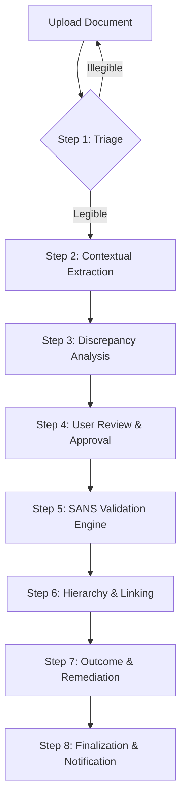

# COC Validation System - Complete Specification

> **Version:** 2.0  
> **Last Updated:** 2026-01-14  
> **Standard:** SANS 10142-1:2020  
> **System:** WM Compliance - Electrical Certificate of Compliance Verification Engine

---

## Table of Contents

1. [System Overview](#1-system-overview)
2. [Process Flow](#2-process-flow)
3. [Edge Functions](#3-edge-functions)
4. [Validation Rules](#4-validation-rules)
5. [COC Hierarchy & Type Logic](#5-coc-hierarchy--type-logic)
6. [Database Schema](#6-database-schema)
7. [UI Components](#7-ui-components)
8. [Status Mappings](#8-status-mappings)
9. [Error Handling](#9-error-handling)
10. [Post-Processing Logic](#10-post-processing-logic)
11. [API Reference](#11-api-reference)
12. [Test Cases](#12-test-cases)

---

## 1. System Overview

### 1.1 Purpose

The COC Validation System is an AI-powered verification engine that:
- **Extracts** data from Electrical Certificate of Compliance (COC) PDF documents
- **Validates** extracted data against SANS 10142-1:2020 standards
- **Reports** compliance status with detailed findings and remediation guidance
- **Stores** validation results for audit trails and reporting

### 1.2 Key Features

| Feature | Description |
|---------|-------------|
| **PDF Vision Analysis** | Uses Google Gemini 3 Pro Preview for visual document analysis |
| **SANS 10142-1:2020 Compliance** | Full clause-level validation against SA electrical standards |
| **COC Hierarchy Validation** | Validates Initial/Supplementary/Temporary certificate relationships |
| **Checkbox State Detection** | Mandatory verification of COC type checkbox marking |
| **Audit Trail** | Complete logging of all validation decisions with timestamps |
| **PDF Report Generation** | Generates professional validation reports for download |

### 1.3 Supported Document Types

- PDF documents (primary - vision analysis)
- Image files (JPG, JPEG, PNG, WebP, GIF)
- Text files (fallback)

### 1.4 Technology Stack

| Component | Technology |
|-----------|------------|
| AI Model (Validation) | `google/gemini-3-pro-preview` |
| AI Model (Extraction) | `google/gemini-2.5-pro` (PDF), `google/gemini-2.5-flash` (targeted) |
| Backend | Supabase Edge Functions (Deno) |
| Frontend | React + TypeScript |
| PDF Generation | pdfmake |
| Database | PostgreSQL (Supabase) |

---

## 2. Process Flow

### 2.1 High-Level Flow Diagram



### 2.2 Detailed Process Steps

#### Step 1: Document Upload & Triage
1. User uploads COC PDF to "Certificate of Compliance" category.
2. System performs a basic legibility and orientation check.
3. AI identifies if the document is a single-page or multi-page COC.
4. Auto-rotates or prompts user if the scan quality is too low for OCR.

#### Step 2: Contextual Extraction (`extract-coc`)
1. AI extracts raw data from the document.
2. System fetches context from the database (Current Subsection Address, Contractor Details, Previous COCs).
3. AI uses this context to improve extraction accuracy (e.g., matching ambiguous handwriting to known addresses).

#### Step 3: Discrepancy Analysis
1. System compares extracted data (Address, ID Number, Registration) against system records.
2. Flag mismatches as "Warnings" in the review UI.
3. Identify if the COC Number already exists in the system to prevent duplicates.

#### Step 4: User Review & Approval Loop
1. User reviews data in the `COCPreviewApproval` UI.
2. Warnings/Discrepancies are highlighted in yellow.
3. User can manually correct fields or trigger a "Targeted Re-extraction".
4. User clicks "Approve & Validate" to proceed.

#### Step 5: SANS Validation Engine (`validate-coc`)
1. AI executes the full SANS 10142-1 logic suite.
2. Measurements are checked against physical constants and clause thresholds.
3. Logic consistency check (e.g., if earth resistance is high, check if it matches the supply system type).

#### Step 6: Hierarchy & Linking
1. If "Supplementary" or "Temporary", system attempts to find the "Initial" COC in the same project/site.
2. Establishes a database link between certificates.
3. Validates that the Supplementary COC doesn't contradict the Initial COC's foundation.

#### Step 7: Outcome & Remediation
1. Overall "Pass" or "Fail" is assigned.
2. For "Fail", specific "Remediation Steps" are generated per clause.
3. Tasks automatically created for the contractor if integrated with the project management module.

#### Step 8: Finalization & Notification
1. Validation report is generated and archived.
2. System updates the Subsection status to "Compliant" or "Non-Compliant".
3. Notifications sent to relevant stakeholders (Client, Safety Officer, Contractor).

---

## 3. Edge Functions

### 3.1 `extract-coc` Edge Function

**Location:** `supabase/functions/extract-coc/index.ts`

**Purpose:** Extract raw data from COC documents without performing validation.

#### Input Parameters

```typescript
interface ExtractCOCRequest {
  documentUrl: string;     // Signed URL to the PDF in Supabase Storage
  fileName: string;        // Original filename
  retryFields?: string[];  // Optional: specific fields to re-extract
}
```

#### Output Format

```typescript
interface ExtractCOCResponse {
  success: boolean;
  data: {
    cocNumber: string | null;
    cocType: "Initial" | "Supplementary" | "Temporary" | "Not Marked";
    cocIssueDate: string | null;  // YYYY-MM-DD
    supplementDetails?: {
      supplementNo: string | null;
      initialCertificateNo: string | null;
      issuedOn: string | null;
    };
    temporaryDetails?: {
      expiryDate: string | null;
      validityPeriod: string | null;
      reason: string | null;
    };
    administrativeDetails: {
      physicalAddress: string | null;
      buildingName: string | null;
      registeredPerson: string | null;
      idNumber: string | null;
      registrationNumber: string | null;
      registrationType: string | null;
      // ... more fields
    };
    testResults: {
      earthLoopImpedance: string | null;
      insulationResistance: string | null;
      earthContinuityResistance: string | null;
      // ... more fields
    };
    installationDetails: {
      electricitySupplySystem: string | null;
      voltage: string | null;
      numberOfPhases: string | null;
      // ... more fields
    };
    confidence: "high" | "medium" | "low";
    extractionNotes: string[];
  };
  error?: string;
}
```

#### Extraction Prompts

| Prompt | Purpose | Model |
|--------|---------|-------|
| `PAGE_1_PROMPT` | Certificate front page extraction | gemini-2.5-pro |
| `PAGE_2_PROMPT` | Test report extraction | gemini-2.5-pro |
| `TARGETED_EXTRACTION_PROMPT` | Re-extract specific missing fields | gemini-2.5-flash |
| `FULL_EXTRACTION_PROMPT` | Complete document extraction | gemini-2.5-pro |

---

### 3.2 `validate-coc` Edge Function

**Location:** `supabase/functions/validate-coc/index.ts`

**Purpose:** Perform comprehensive SANS 10142-1:2020 validation on COC documents.

#### Input Parameters

```typescript
interface ValidateCOCRequest {
  documentId: string;      // UUID of the document in subsection_documents
  documentUrl: string;     // Signed URL to the PDF
  subsectionId: string;    // UUID of the parent subsection
}
```

#### Output Format

```typescript
interface ValidateCOCResponse {
  success: boolean;
  status: "Pass" | "Fail" | "Incomplete" | "Error";
  confidenceScore: number;  // 0-100
  documentQuality: "Excellent" | "Good" | "Fair" | "Poor";
  violations: CriticalFailure[];
  summary: ValidationSummary;
  checks: ValidationCheck[];
  administrativeDetails: AdminDetails;
  technicalEvaluation: TechnicalEval[];
  recommendations: string[];
  extractionNotes: string[];
  report: FullValidationReport;
}

interface CriticalFailure {
  category: "Safety" | "Technical" | "Administrative";
  clause: string;
  description: string;
  reason: string;
  immediateAction: string;
  riskLevel: "High" | "Medium" | "Low";
}

interface ValidationCheck {
  checkId: string;
  clause: string;
  description: string;
  result: "Pass" | "Fail" | "Not Tested" | "Not Applicable";
  measuredValue: string;
  limit: string;
  remediation: string;
  category: "Safety-Critical" | "Mandatory" | "Administrative" | "Recommended";
  severity: "Critical" | "Major" | "Minor";
  sansReference: string;
  timestamp: string;
}
```

---

## 4. Validation Rules

### 4.1 COC Hierarchy Checks

| Check ID | Clause | Description | Category | Severity |
|----------|--------|-------------|----------|----------|
| COC-TYPE-001 | Hierarchy | COC Type Checkbox Must Be Marked | Mandatory | Critical |
| COC-INIT-001 | Hierarchy | Initial COC Requirement | Mandatory | Critical |
| COC-SUPP-001 | Hierarchy | Supplementary COC Reference Validation | Mandatory | Critical |
| COC-TEMP-001 | Hierarchy | Temporary COC Validity Period | Mandatory | Critical |
| COC-VALID-001 | Hierarchy | Overall COC Hierarchy Compliance | Mandatory | Critical |

### 4.2 Safety-Critical Technical Checks

| Check ID | Clause | Description | Limit | Category |
|----------|--------|-------------|-------|----------|
| EARTH-001 | 8.4 | Earth Resistance | ≤1Ω (TN), ≤20Ω (TT w/RCD) | Safety-Critical |
| LOOP-001 | 8.5 | Earth Loop Impedance | Per MCB rating table | Safety-Critical |
| INSUL-001 | 8.6 | Insulation Resistance | ≥1.0MΩ for ≤500V | Safety-Critical |
| RCD-001 | 8.8 | RCD Protection | ≤300ms at 1×IΔn | Safety-Critical |
| POL-001 | 8.7 | Polarity & Continuity | Correct polarity, ≤1Ω | Safety-Critical |

### 4.3 Earth Loop Impedance Limits (Type B MCB)

| MCB Rating | Max Zs (Ω) |
|------------|-----------|
| 6A | 7.67 |
| 10A | 4.60 |
| 16A | 2.87 |
| 20A | 2.30 |
| 25A | 1.84 |
| 32A | 1.44 |
| 40A | 1.15 |
| 50A | 0.92 |
| 63A | 0.73 |

> **Note:** For Type C MCB multiply by 0.5, for Type D MCB multiply by 0.25

### 4.4 RCD Trip Time Requirements

| Test Current | Maximum Trip Time |
|--------------|-------------------|
| 1× IΔn | ≤ 300ms |
| 2× IΔn | ≤ 150ms |
| 5× IΔn | ≤ 40ms |

### 4.5 Mandatory Administrative Checks

| OCP-001 | 8.3 | Overcurrent Protection Correct |

### 4.6 Data Integrity & System Cross-Checks

| Check ID | Description | Logic |
|----------|-------------|-------|
| SYS-ADDR-001 | Address Match | Extracted address must match subsection installation address (within 80% fuzzy match) |
| SYS-CONT-001 | Contractor Match | Registered Person/Number should match an approved contractor in the system |
| SYS-DUP-001 | Duplicate Check | COC Number must not already exist for a different subsection |
| SYS-DATE-001 | Contextual Date | Test date should be within the project duration or before handover |

---

## 5. COC Hierarchy & Type Logic

### 5.1 COC Type Determination

The system uses a **checkbox-first approach** to determine COC type:

```
┌─────────────────────────────────────────────────────────────┐
│  STEP 1: Locate Checkboxes                                 │
│  □ Initial    □ Supplementary    □ Temporary               │
└─────────────────────────────────────────────────────────────┘
                           │
                           ▼
┌─────────────────────────────────────────────────────────────┐
│  STEP 2: Examine Each Checkbox                              │
│  MARKED = ☑, ✓, X, filled box, handwritten tick            │
│  EMPTY = □, ☐, only outline visible                        │
└─────────────────────────────────────────────────────────────┘
                           │
                           ▼
┌─────────────────────────────────────────────────────────────┐
│  STEP 3: Set cocType Based on Marked Box                   │
│  - initialBox MARKED → cocType = "Initial"                 │
│  - supplementaryBox MARKED → cocType = "Supplementary"     │
│  - temporaryBox MARKED → cocType = "Temporary"             │
│  - ALL EMPTY → cocType = null (FAIL)                       │
└─────────────────────────────────────────────────────────────┘
```

### 5.2 Mandatory Checkbox States Response

The AI **MUST** include `checkboxStates` in every validation response:

```json
{
  "checkboxStates": {
    "initialBox": "MARKED | EMPTY",
    "initialBoxDescription": "Description of what is visible",
    "supplementaryBox": "MARKED | EMPTY",
    "supplementaryBoxDescription": "Description of what is visible",
    "temporaryBox": "MARKED | EMPTY",
    "temporaryBoxDescription": "Description of what is visible"
  }
}
```

### 5.3 Hierarchy Validation Rules

#### Initial COC Rules
- **DOES NOT** need to reference another COC
- Stands alone as the foundational compliance document
- **NEVER** flag "Missing Initial COC Reference" for Initial COCs
- Set COC-SUPP-001 and COC-TEMP-001 to "Not Applicable"

#### Supplementary COC Rules (ONLY if cocType = "Supplementary")
- **MUST** reference an Initial COC number
- Initial COC must exist and be valid
- Cannot replace Initial COC, only extends/modifies
- Fail COC-SUPP-001 if Initial reference is missing

#### Temporary COC Rules (ONLY if cocType = "Temporary")
- **MUST** reference an Initial COC number
- Provides only provisional/temporary authorization
- Cannot establish compliance alone
- Fail COC-TEMP-001 if Initial reference is missing

### 5.4 Non-Compliance Conditions

Premises are **NON-COMPLIANT** if:

| Condition | Applies To |
|-----------|------------|
| COC Type checkbox NOT marked | All COC types |
| Supplementary COC without Initial reference | Supplementary only |
| Temporary COC without Initial reference | Temporary only |

### 5.5 Important Notes

> ⚠️ **COCs DO NOT EXPIRE.** An Electrical Certificate of Compliance remains valid indefinitely once issued, unless:
> - The installation is altered (requiring a new Supplementary COC)
> - The installation is found non-compliant upon re-inspection
> - The COC is formally revoked by authorities
>
> **DO NOT** report COC expiry as a failure condition.

---

## 6. Database Schema

### 6.1 `subsection_documents` Table

Stores individual document records with per-document COC data.

| Column | Type | Description |
|--------|------|-------------|
| id | UUID | Primary key |
| subsection_id | UUID | Foreign key to subsections |
| category_id | UUID | Foreign key to document_categories |
| file_name | TEXT | Original filename |
| file_url | TEXT | Storage URL |
| file_size | INTEGER | File size in bytes |
| coc_number | TEXT | Extracted COC certificate number |
| coc_type | TEXT | "Initial" \| "Supplementary" \| "Temporary" \| null |
| coc_status | TEXT | "approved" \| "rejected" \| "pending" |
| coc_issue_date | DATE | Certificate issue date |
| uploaded_at | TIMESTAMPTZ | Upload timestamp |
| uploaded_by | UUID | User who uploaded |

### 6.2 `coc_validations` Table

Stores full validation reports for audit trail.

| Column | Type | Description |
|--------|------|-------------|
| id | UUID | Primary key |
| document_id | UUID | Foreign key to subsection_documents (UNIQUE) |
| subsection_id | UUID | Foreign key to subsections |
| status | TEXT | "Pass" \| "Fail" \| "Incomplete" \| "Error" |
| violations | JSONB | Array of critical failures |
| report_data | JSONB | Full validation report JSON |
| validated_at | TIMESTAMPTZ | Validation timestamp |
| validated_by | UUID | User who triggered validation |
| created_at | TIMESTAMPTZ | Record creation timestamp |

### 6.3 `subsections` Table (COC-Related Fields)

Stores aggregated/best COC data for the subsection.

| Column | Type | Description |
|--------|------|-------------|
| coc_number | TEXT | Best COC number for subsection |
| coc_type | TEXT | Approved COC type |
| coc_status | TEXT | "Approved" \| "Failed" \| "pending" |
| coc_issue_date | DATE | Issue date of best COC |
| is_compliant | BOOLEAN | Overall compliance status |

### 6.4 Status Value Mappings

#### Document Status (`subsection_documents.coc_status`)
| Validation Result | Document Status |
|-------------------|-----------------|
| Pass | `approved` |
| Fail | `rejected` |
| Incomplete | `pending` |

#### Subsection Status (`subsections.coc_status`)
| Validation Result | Subsection Status |
|-------------------|-------------------|
| Pass | `Approved` |
| Fail | `Failed` |
| Incomplete | `pending` |

---

## 7. UI Components

### 7.1 `SubsectionDetail.tsx`

**Location:** `src/pages/SubsectionDetail.tsx`

Main page for viewing and managing subsection documents including COC validation.

**Key Functions:**
- `handleDocumentVerification()` - Triggers validate-coc for a document
- `handleApproveAndVerify()` - Approves extraction and triggers validation
- Document upload handling for COC category

### 7.2 `COCValidationReport.tsx`

**Location:** `src/components/COCValidationReport.tsx`

Displays detailed validation results including:
- Executive Summary (COC Type, Status, Assessment)
- Critical Failures section (red highlighted)
- Administrative Details
- Technical Evaluation table
- Recommendations
- Preview & Save Report button

### 7.3 `COCPreviewApproval.tsx`

**Location:** `src/components/COCPreviewApproval.tsx`

Modal for reviewing extracted COC data before validation:
- Displays extracted fields
- Allows re-extraction of specific fields
- Approve/Reject buttons
- Shows extraction confidence

### 7.4 `BulkCOCReportSave.tsx`

**Location:** `src/components/BulkCOCReportSave.tsx`

Enables bulk generation and saving of COC validation reports:
- Fetches validations for multiple subsections
- Generates PDFs using `generateCOCValidationPDF()`
- Saves to document management system

---

## 8. Status Mappings

### 8.1 UI Badge Colors

| Status | Color | Icon |
|--------|-------|------|
| Pass / Approved | Green (`bg-green-100`) | ✓ CheckCircle2 |
| Fail / Failed | Red (`bg-red-100`) | ✗ XCircle |
| Incomplete / Pending | Yellow (`bg-yellow-100`) | ⚠ AlertTriangle |
| Error / Unknown | Gray (`bg-gray-100`) | ⚠ AlertTriangle |

### 8.2 is_compliant Determination

A subsection is marked `is_compliant = true` ONLY if ALL conditions are met:

1. ✅ COC Type checkbox was marked on certificate (`cocTypeMarked = true`)
2. ✅ Validation passed (`status = Approved`)
3. ✅ Hierarchy is valid (no "Invalid - Missing Reference" status)
4. ✅ No critical failures (`criticalFailures.length === 0`)

```javascript
is_compliant = cocTypeMarked && validationPassed && hierarchyValid && !hasCriticalFailures;
```

---

## 9. Error Handling

### 9.1 Edge Function Errors

| Error Code | Message | User Action |
|------------|---------|-------------|
| 400 | Missing required parameters | Retry with correct parameters |
| 402 | Payment required | Add credits to Lovable AI workspace |
| 429 | Rate limit exceeded | Wait and retry |
| 500 | Internal error | Report issue, retry later |

### 9.2 Fallback Validation Result

When AI response cannot be parsed:

```javascript
{
  overallStatus: 'Error',
  confidenceScore: 0,
  documentQuality: 'Poor',
  checks: [],
  criticalFailures: [{
    category: 'Technical',
    clause: 'N/A',
    description: 'Failed to parse validation response',
    reason: 'The AI response could not be interpreted as valid JSON',
    immediateAction: 'Please try validating the document again',
    riskLevel: 'Medium'
  }],
  extractionNotes: ['Parsing error occurred - please retry validation']
}
```

---

## 10. Post-Processing Logic

### 10.1 Checkbox States Validation & Override

After AI response, the server validates that `cocType` matches `checkboxStates`:

```javascript
// Determine correct cocType from checkbox states
if (initialMarked && !supplementaryMarked && !temporaryMarked) {
  correctCocType = 'Initial';
} else if (supplementaryMarked && !initialMarked && !temporaryMarked) {
  correctCocType = 'Supplementary';
} else if (temporaryMarked && !initialMarked && !supplementaryMarked) {
  correctCocType = 'Temporary';
} else if (!initialMarked && !supplementaryMarked && !temporaryMarked) {
  correctCocType = null; // No checkbox marked
}

// Override if mismatch detected
if (correctCocType !== validationResult.cocType) {
  validationResult.cocType = correctCocType;
  validationResult.extractionNotes.push(
    `SERVER OVERRIDE: cocType changed from "${original}" to "${correctCocType}"`
  );
}
```

### 10.2 Initial COC Violation Filtering

**CRITICAL:** For Initial COCs, remove any incorrectly flagged "Missing Initial COC Reference" violations:

```javascript
if (currentCocType === 'initial') {
  // Filter criticalFailures
  validationResult.criticalFailures = validationResult.criticalFailures.filter(failure => {
    const description = failure.description.toLowerCase();
    const reason = failure.reason.toLowerCase();
    
    // Remove if violation is about missing Initial reference
    const isMissingRefViolation = 
      description.includes('missing initial coc') ||
      description.includes('does not reference') ||
      description.includes('without referencing') ||
      description.includes('initial coc reference');
    
    return !isMissingRefViolation; // Remove invalid violations
  });
  
  // Also update checks to "Not Applicable"
  validationResult.checks = validationResult.checks.map(check => {
    if (check.result === 'Fail' && check.description.includes('initial coc reference')) {
      return { ...check, result: 'Not Applicable' };
    }
    return check;
  });
  
  // Recalculate overallStatus if no more critical failures
  if (validationResult.criticalFailures.length === 0) {
    const failCount = validationResult.checks.filter(c => c.result === 'Fail').length;
    if (failCount === 0) {
      validationResult.overallStatus = 'Pass';
    }
  }
}

### 10.3 Remediation & Notification Workflow

1.  **Failure Triggers:**
    - If `overallStatus` is "Fail", the system identifies all checks with `result: "Fail"`.
    - `criticalFailures` are prioritized for immediate corrective action.

2.  **Notification Logic:**
    - **Contractor:** Receives an email with the remediation guide and a link to re-upload.
    - **Site Manager:** Receives a summary of the safety-critical failures.

3.  **Resolution Loop:**
    - Document status is set to `rejected`.
    - Subsection `is_compliant` remains `false`.
    - System waits for a new document upload or a re-validation trigger after manual data correction.
```

---

## 11. API Reference

### 11.1 Invoke Validation

```typescript
const { data, error } = await supabase.functions.invoke('validate-coc', {
  body: {
    documentId: 'uuid-of-document',
    documentUrl: 'https://signed-url-to-pdf',
    subsectionId: 'uuid-of-subsection'
  }
});

if (data.success) {
  console.log('Status:', data.status);
  console.log('Violations:', data.violations);
  console.log('Full Report:', data.report);
}
```

### 11.2 Invoke Extraction

```typescript
const { data, error } = await supabase.functions.invoke('extract-coc', {
  body: {
    documentUrl: 'https://signed-url-to-pdf',
    fileName: 'COC-123456.pdf',
    retryFields: ['cocNumber', 'cocIssueDate'] // Optional
  }
});

if (data.success) {
  console.log('Extracted Data:', data.data);
  console.log('Confidence:', data.data.confidence);
}
```

### 11.3 Query Validations

```typescript
const { data: validations } = await supabase
  .from('coc_validations')
  .select('*')
  .eq('subsection_id', subsectionId)
  .order('validated_at', { ascending: false });
```

---

## 12. Test Cases

### 12.1 COC Type Detection Tests

| Test Case | Expected cocType | Expected Check Results |
|-----------|------------------|------------------------|
| Initial checkbox marked | `Initial` | COC-SUPP-001: Not Applicable, COC-TEMP-001: Not Applicable |
| Supplementary checkbox marked, with Initial reference | `Supplementary` | COC-SUPP-001: Pass |
| Supplementary checkbox marked, NO Initial reference | `Supplementary` | COC-SUPP-001: Fail |
| Temporary checkbox marked, with Initial reference | `Temporary` | COC-TEMP-001: Pass |
| No checkbox marked | `null` | COC-TYPE-001: Fail |

### 12.2 Hierarchy Violation Tests

| Test Case | Expected Behavior |
|-----------|-------------------|
| Initial COC with blank reference field | NO "Missing Initial Reference" violation |
| Supplementary COC with blank reference field | Fail COC-SUPP-001 |
| Initial COC misidentified as needing reference | Post-processing removes false violation |

### 12.3 Technical Validation Tests

| Test Case | Check ID | Expected Result |
|-----------|----------|-----------------|
| Earth resistance = 0.5Ω (TN system) | EARTH-001 | Pass |
| Earth resistance = 2.0Ω (TN system) | EARTH-001 | Fail |
| Insulation resistance = 500MΩ | INSUL-001 | Pass |
| Insulation resistance = 0.2MΩ | INSUL-001 | Fail (Critical) |
| RCD trips at 250ms (1×IΔn) | RCD-001 | Pass |
| RCD trips at 400ms (1×IΔn) | RCD-001 | Fail |

### 12.4 System Integration Tests

| Test Case | Check ID | Expected Result |
|-----------|----------|-----------------|
| Extracted address "123 Main St" vs DB "123 Main Street" | SYS-ADDR-001 | Pass (Fuzzy Match) |
| Extracted address "999 Wrong Rd" vs DB "123 Main St" | SYS-ADDR-001 | Fail (Warning) |
| COC Number "ECA-100" already in DB for Subsection B | SYS-DUP-001 | Fail (Blocking) |

---

## Changelog

| Date | Version | Changes |
|------|---------|---------|
| 2026-01-14 | 2.0 | Added post-processing logic for Initial COC violations; Updated checkbox state handling |
| 2025-12-01 | 1.5 | Enhanced COC type detection with mandatory checkboxStates |
| 2025-11-15 | 1.0 | Initial specification release |

---

## Support

For issues or questions about the COC Validation System:
- Check Edge Function logs: [Supabase Dashboard](https://supabase.com/dashboard/project/oltzgidkjxwsukvkomof/functions)
- Review validation rules in this document
- Contact the development team

---

*This document should be updated whenever changes are made to the COC validation logic, edge functions, or database schema.*
