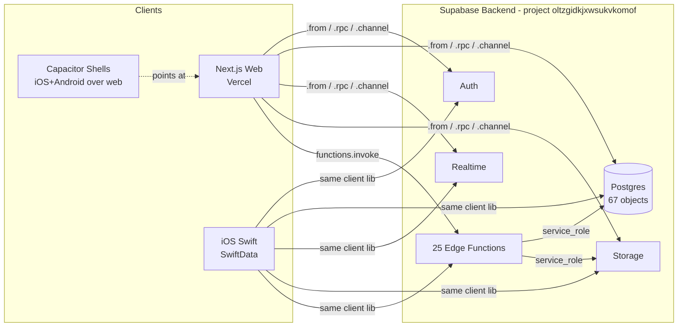

# Parity Build Plan — insight-linker-app

**Status:** DRAFT (build-planner output, will be polished by doc-coauthoring)
**Date:** 2026-05-25
**Input:** [PARITY_GAP_ANALYSIS.md](./PARITY_GAP_ANALYSIS.md), [AUDIT_BASELINE.md](./AUDIT_BASELINE.md), [../../ECompliance 2/docs/DATABASE_MAP.md](../../ECompliance%202/docs/DATABASE_MAP.md)
**Calendar:** ~13 weeks (6 two-week sprints + a Sprint 0 setup week)

---

## Part 1: Challenges Acknowledged (Phase 2 condensed)

1. **iOS-team coordination is a cross-team risk.** RE-2, RE-3, RE-4, RE-5 require iOS engineer time. Flagged in the risk register; Sprint 0 includes a coordination handshake. If iOS can't commit, web work doesn't strictly block (web reads what's there), but cross-device parity isn't reached.
2. **RE-1 architecture decision: canonical = `inspections.json_data` (iOS-style). Deprecate the `inspection_items` table.** Rationale below. Open to reversal during Sprint 0 if there's an analytics/reporting reason to retain the relational table.
3. **Effort estimates buffered 1.5×** from the gap-analysis numbers. Sprints have slack between tasks rather than wall-to-wall packing.
4. **AUDIT_BASELINE deferred items get a dedicated Sprint 6** (Tech Debt) + a parallel low-percentage "Infrastructure" track across all sprints. They are not deferred indefinitely.

---

## Part 2: Tech Stack (Locked)

No new stack decisions — all locked from the existing apps. Documented here for completeness.

| Layer | Choice | Constraint that justifies it |
|---|---|---|
| Web framework | Next.js 15.3 (App Router) | Already deployed; team familiar; matches Vercel hosting |
| UI | React 18 + Radix + shadcn + Tailwind | Existing component library |
| Web state | TanStack Query v5 | Already wired; pairs with Supabase async patterns |
| Validation | Zod | Existing `validation-schemas.ts`; will expand from 7 schemas to ~25 to cover the parity entities |
| Native shells | Capacitor 7 (iOS + Android) | Wraps the Vercel URL; minimal native code |
| Backend | Supabase (Postgres + Edge Functions + Storage + Auth + Realtime) | Shared with iOS app; single source of truth |
| Edge runtime | Deno (Supabase Edge Functions) | Standard for Supabase |
| Hosting | Vercel (web), App Store / Play (Capacitor shells) | Already in production |
| iOS-side | Swift / SwiftUI / SwiftData | Existing app |

**Rejected** during this plan: nothing — no new tech needed.

---

## Part 3: Architecture (No structural changes)

The existing architecture handles parity without new components. New work adds rows in the existing patterns.

**Only new architectural addition:** **Schema-vs-DTO CI gate** (Sprint 0 deliverable) — a script that diffs the Postgres OpenAPI spec against Zod schemas (web) and reports a list against expected iOS DTO fields. Catches D5/D6/D7 recurrence at PR-review time.

---

## Part 4: Data Model

No schema changes required for the ADD list — all the missing functionality reads existing tables. Schema implications:

| Decision | Affected | Action |
|---|---|---|
| RE-1: canonical = `inspections.json_data` | `inspection_items` table (web/legacy) | Plan migration to drop after Sprint 4 (zero readers confirmed) |
| RE-3: photo sync via `offline_photos` (iOS catches up to web) | iOS `Photo` model | iOS-side DTO + push/fetch path |
| RE-4: D5 phantom columns | 6 iOS DTOs | iOS-side resolution per column (drop field OR add column migration) |
| RE-5: `site_marking_checklist.item_id` | iOS `SiteMarkingChecklistItemDTO` | iOS-side 1-field addition |
| RE-7: schematics editor | `site_schematics`, `schematic_blocks` (existing tables, light usage) | Possible additional columns surface during build — defer to Sprint 4 |
| RE-8: QR codes write path | `qr_codes` | Investigation only; possibly no schema change |

**The shared backend schema (67 Postgres objects) is the source of truth.** Refer to [DATABASE_MAP.md](../../ECompliance%202/docs/DATABASE_MAP.md) for full reference.

---

## Part 5: Feature Breakdown

Per-gap task definitions. Each block includes: user story, acceptance criteria, complexity (S/M/L/XL), dependencies, and which engineer track owns it.

### ADD-1: Inspection Subsections Hook & Wiring — Complexity L
**User story:** As an inspector reviewing an existing inspection, I want to see the same per-subsection breakdown on web that I see on iOS so cross-device handoffs don't lose context.

**Acceptance criteria:**
- `useInspectionSubsections(inspectionId)` hook reads from `inspection_subsections` with joined `subsections(*)` and `inspections(*)`.
- `InspectionDetail` view renders one row per subsection with status, score, last-update.
- `Inspections` list shows per-subsection rollup count.
- IndexedDB `offlineDB` adds an `inspection_subsections` store + sync wiring via `useOfflineSync`.
- Smoke test: an inspection created on iOS with 3 subsections shows 3 rows on web.

**Dependencies:** Sprint 0 ESLint fix. Reads from web side only.
**Owner:** Web frontend.

### ADD-2: Activity Log Feed — Complexity M
**User story:** As an admin/inspector, I want to see a chronological log of what happened across sites/inspections so I can audit changes and onboard new team members.

**Acceptance criteria:**
- `useActivityLog(scope?)` hook + `logActivity(type, payload)` helper.
- Every create/update/delete on sites, subsections, inspections, snags emits an `activity_logs` row.
- Sidebar feed component shows the last 50 entries with filter by scope (Site / Inspection / Subsection).
- Cross-device: an action taken on iOS shows up in web feed within one refresh.

**Dependencies:** None.
**Owner:** Web frontend + thin backend (logging utility used by Edge Functions on iOS-originated writes — already in place).

### ADD-3: Notifications Bell + Realtime — Complexity L
**User story:** As a user, I want to receive in-app notifications for events relevant to me (assigned site, inspection due, COC review requested) without polling.

**Acceptance criteria:**
- Notification bell icon in `(admin)/layout.tsx` header with unread badge.
- `useNotifications()` hook subscribes to `notifications` table via `supabase.channel().on('postgres_changes')` filtered to current user.
- Click opens a popover showing recent items; clicking an item marks it read and navigates if URL present.
- iOS users already get push; web closes the loop with in-app surface.
- E2E test confirms a row inserted via SQL appears in the bell within 5 seconds.

**Dependencies:** None.
**Owner:** Web frontend.

### ADD-4: COC Validation Settings Reader — Complexity S
**User story:** As an admin, I want to see and (if permitted) configure COC validation thresholds on web that iOS already respects.

**Acceptance criteria:**
- `useCOCValidationSettings()` hook reads `coc_validation_settings`.
- `Settings` view shows a "COC Validation" tab displaying current rules.
- Permission: read for all roles; write for Admin only (subject to RLS, deferred to backend audit).
- Cross-device verification: settings changed on iOS appear on web within a refresh.

**Dependencies:** None.
**Owner:** Web frontend.

### ADD-5: COC Local Validations Reader — Complexity M
**User story:** As an inspector or admin, I want to see locally-recorded COC validation results from iOS on the web so I can review and approve from a desktop.

**Acceptance criteria:**
- `useCOCLocalValidations(subsectionId)` hook.
- COC tab on `SubsectionDetail` shows a list of `coc_local_validations` rows when present.
- Result-shape Zod schema added to `validation-schemas.ts` (currently 7 schemas → +1 here, +others throughout build).
- D5 phantom columns (`coc_form_type`, `mcb_rating_a`, etc.) NOT included on web read until iOS-side cleanup (RE-4) confirms canonical shape.

**Dependencies:** None (read-only). Display only what's present.
**Owner:** Web frontend.

### ADD-6: COC Compliance Photos Fuller Integration — Complexity M
**User story:** As an inspector reviewing COC compliance, I want to see all linked photos in the web inspection detail view.

**Acceptance criteria:**
- `coc_compliance_photos` integrated into `SubsectionDetail` COC tab as a gallery.
- Photo URLs resolved via existing `imageUrlResolver` lib.
- Upload from web works (web → Supabase Storage → `coc_compliance_photos` row).
- Cross-device: photos uploaded on iOS appear on web and vice versa.

**Dependencies:** ADD-5 (same view).
**Owner:** Web frontend.

### ADD-7: Reports Persistence — Complexity M
**User story:** As a user generating a PDF report on web, I want it persisted to the `reports` table so I can find it later and iOS users can see it too.

**Acceptance criteria:**
- After successful Edge Function PDF generation, insert into `reports` (uploaded_url, metadata, generated_by, generated_at).
- `Reports` view on web reads from `reports` table (currently 0 readers).
- Existing iOS reads from `reports` already; cross-device verification confirms a web-generated PDF appears in iOS list.
- Deprecate 3 dead `generate-pdf-{browserless,google,pdfmake}` Edge Functions in same PR (AUDIT_BASELINE Pass 3 finding).

**Dependencies:** Confirm which `generate-pdf` Edge Function is canonical.
**Owner:** Web frontend + Edge Function modification.

### RE-1: InspectionItem Canonical Storage Decision — Complexity S (decision) / N/A (implementation if dead-table-drop confirmed)
**Decision:** `inspections.json_data` is canonical. The `inspection_items` table is dropped after Sprint 4 confirms zero readers in both apps.

**Acceptance criteria:**
- Web grep confirms zero readers of `inspection_items`.
- iOS DATABASE_MAP regenerated confirms no SwiftData model writes to it.
- Migration drops the table cleanly (with backup snapshot per DATABASE_MAP §D11 convention).
- DATABASE_MAP D3 entry removed.

**Dependencies:** Sprint 0 decision confirmation.
**Owner:** Architecture (decision); backend (migration).

### RE-2: iOS Subsection Installation Push — Complexity XS
**Acceptance criteria:** iOS `SubsectionPushDTO` includes `installation_status` and `installation_score`. DATABASE_MAP D7 entry removed. Stale CLAUDE.md claim corrected.
**Dependencies:** iOS engineer 1 hour.
**Owner:** iOS engineer.

### RE-3: iOS Photo Sync via `offline_photos` — Complexity L
**Acceptance criteria:** iOS `Photo` model gains DTO + push/fetch paths against `offline_photos` table (polymorphic `context_type`/`context_id`). Existing local-only photos migrated. DATABASE_MAP D4 entry removed.
**Dependencies:** iOS engineer 2 weeks.
**Owner:** iOS engineer.

### RE-4: iOS D5 Phantom-Column DTO Cleanup — Complexity M
**Per DATABASE_MAP §D5:**
- `SnagDTO` — drop `rectification_photo_url`, `derived_from_rule`; map to `rectification_photos` jsonb + `closeout_photo_url`.
- `SiteMarkingChecklistItemDTO` — drop `item_type`; add `item_id` (also RE-5).
- `COCLocalValidationDTO` — drop 5 fields with no backing column.
- `SubsectionDocumentDTO` — drop `created_at`, `updated_at`; map to `uploaded_at`.
- `SiteAssetDTO` — replace `type` with `asset_category` (enum).
- `ProfileDTO` — **decision needed**: either keep `first_name`/`last_name` and add migration, or drop and use `full_name` only. Recommend: add migration (user-facing field separation matters).
**Owner:** iOS engineer ~1 week, with one product call on Profile.

### RE-5: iOS `site_marking_checklist.item_id` Fix — Complexity XS
**Acceptance criteria:** DTO includes `item_id`. Inserts succeed. DATABASE_MAP D6 removed.
**Dependencies:** iOS engineer 1 hour.
**Owner:** iOS engineer.

### RE-6: Web offlineDB Consolidation — Complexity L
**Acceptance criteria:**
- Single canonical IndexedDB module (recommend `offlineDB.ts` as it has 8 importers vs `offlineInspectionDB.ts`'s 3).
- The 3 `offlineInspectionDB` consumers (`PlatformCapabilityTester`, `useOfflineInspectionDetail`, `OfflineSyncTest` view) migrated.
- Stores unique to `offlineInspectionDB` (`inspection_cache`, `inspection_images`, `template_cache`) preserved in the merged module.
- In-flight queued mutations on existing devices NOT lost (migration script reads both DBs on first boot, merges into canonical).
- After migration, `offlineInspectionDB.ts` deleted.

**Dependencies:** None.
**Owner:** Web frontend. Schedule with care — bug risk on existing user offline state.

### RE-7: Schematics Editor Build-Out — Complexity XL
**Acceptance criteria:**
- Schematic view supports create/edit/delete of `schematic_blocks` per `site_schematics` parent.
- jsonb decode hazard from DATABASE_MAP §D9 audited: `site_schematics.detected_regions` confirmed handled.
- Cross-device parity: schematics edited on web visible on iOS.

**Dependencies:** None blocking.
**Owner:** Web frontend. Largest single web build.

### RE-8: QR Codes Write Path Verification — Complexity S
**Acceptance criteria:** Audit the QR code create path on web (currently uses `qr-redirect` Edge Function with no `.from('qr_codes')` calls). Confirm or fix parity with iOS `QRCodeRecord` lifecycle.
**Dependencies:** Joint with iOS team for cross-check.
**Owner:** Web frontend + iOS verification.

### RE-9: Capacitor Camera UX Tuning — Complexity S
**Acceptance criteria:** Multi-shot capture, EXIF preserved, immediate-review modal match iOS native experience as closely as Capacitor allows.
**Dependencies:** None.
**Owner:** Web frontend (Capacitor).

---

## Part 6: Sprint Plan

Format: 2-week sprints. Team size assumed = 1 web FE + 0.25 iOS engineer (cross-team) + 0.1 backend engineer (Edge Function tweaks). Adjust if real team size differs.

### Sprint 0 — Foundation (Week 1)

Goal: clear runway. No new features.

| Task | Owner | Effort | Blocks |
|---|---|---|---|
| Fix `next lint` ESLint config (`useEslintrc/extensions` removed in v9) | Web | 0.5d | All future PRs that should lint |
| Build the **schema-vs-DTO CI gate** script | Web + iOS | 2d | RE-2/4/5 recurrence prevention |
| iOS coordination handshake — confirm bandwidth for RE-2, RE-3, RE-4, RE-5 | PM + iOS | 0.5d | Sprint planning realism |
| Confirm RE-1 decision (canonical = `inspections.json_data`) | User | 0.25d | Sprint 4 cleanup |
| Cherry-pick: iOS **RE-5** (1 hr) and **RE-2** (1 hr) — small enough to land in Sprint 0 | iOS | 0.5d | Reduces cross-device drift early |

**Exit:** ESLint runs; CI gate exists (even if stub); iOS commits for RE-2 and RE-5 landed and verified via DATABASE_MAP regeneration; RE-1 decision documented.

### Sprint 1 — CRITICAL parity reads (Weeks 2-3)

Goal: web users see the same data iOS users see.

| Gap | Owner | Effort (buffered) |
|---|---|---|
| ADD-4 COC validation settings reader | Web | 3d |
| ADD-1 Inspection subsections hook + wiring | Web | 5d |
| ADD-2 Activity log (read path: feed) | Web | 4d |
| Cross-device smoke check | Web | 1d |

**Exit:** Three CRITICAL ADD items shipped. Web parity for read-only views.

### Sprint 2 — CRITICAL writes + notifications (Weeks 4-5)

Goal: real-time cross-device awareness; web auditability.

| Gap | Owner | Effort |
|---|---|---|
| ADD-2 Activity log (write hooks across all mutation points) | Web | 3d |
| ADD-3 Notifications bell + Realtime | Web | 6d |
| Per-route ErrorBoundary in 3 route-group layouts (AUDIT_BASELINE deferred #14) | Web | 2d |

**Exit:** Web emits activity logs on writes; notifications surface live; failures don't blank the app.

### Sprint 3 — HIGH parity adds + offlineDB consolidation (Weeks 6-7)

| Gap | Owner | Effort |
|---|---|---|
| ADD-5 COC local validations reader | Web | 4d |
| ADD-6 COC compliance photos viewer + uploader | Web | 4d |
| RE-6 offlineDB consolidation (careful migration) | Web | 7d → carries to Sprint 4 if needed |

**Exit:** COC visibility parity. Single canonical offlineDB module (migration verified on a test device with seeded queue).

### Sprint 4 — Reports + schematic editor + tests (Weeks 8-9)

| Gap | Owner | Effort |
|---|---|---|
| ADD-7 Reports persistence + dead-PDF-fn cleanup | Web + Edge | 5d |
| RE-7 Schematic editor build-out | Web | 8d → carries to Sprint 5 if needed |
| Vitest + Playwright smoke tests for parity workflows (AUDIT_BASELINE deferred #15) | Web | 4d |
| RE-1 implementation: drop `inspection_items` table (if zero readers confirmed) | Backend | 1d |

**Exit:** Reports cross-device. Test suite covers happy-path parity. Inspection-items table dropped.

### Sprint 5 — Medium gaps + iOS catch-up verification (Weeks 10-11)

| Gap | Owner | Effort |
|---|---|---|
| RE-8 QR code write path verification | Web + iOS | 2d |
| RE-9 Capacitor camera UX tuning | Web | 3d |
| Verify iOS RE-3, RE-4 landed; regenerate DATABASE_MAP showing zero D3/D4/D5/D6/D7 entries | iOS + PM | 2d |
| Cross-device end-to-end parity walkthroughs (full inspection lifecycle) | QA + Web | 3d |
| Buffer for any earlier-sprint slip | — | 4d |

**Exit:** All 16 gaps closed or explicitly accepted. DATABASE_MAP D-series count = 0 (D8/D9/D10/D11 still informational).

### Sprint 6 — Tech debt cleanup (Weeks 12-13)

Goal: pay down AUDIT_BASELINE deferred items.

| Item | Owner | Effort |
|---|---|---|
| AUDIT-5: restore `noUnusedLocals` + clean 326 unused imports (eslint --fix bulk) | Web | 2d |
| AUDIT-6: resolve 109 strict-mode type errors, remove `ignoreBuildErrors` | Web | 5d |
| AUDIT-10: console statement sweep (561 → ~50 dev-guarded) | Web | 2d |
| AUDIT-11: replace `xlsx` (Prototype Pollution, no fix available) | Web | 2d → could spill |
| AUDIT-13: code-split PDF stack out of route bundles | Web | 2d |

**Exit:** Tsconfig strict-mode fully restored. No moderate/high npm vulns. Bundle sizes for `/review/[token]` and deep nested routes under 600 kB.

### Parallel Infrastructure Track (~10-20% of one engineer across all sprints)

- AUDIT-1 rotate Supabase anon key (one low-risk window mid-plan)
- AUDIT-3 verify rate limiting on `verify_jwt=false` Edge Functions (esp. `extract-coc`)
- AUDIT-12 plan dependency modernization sprint (Capacitor 7→8 first, React/Next later)
- Partial RLS audit via `get_rls_policies_for_role` RPC (covers some of AUDIT-2 without service_role)

---

## Part 7: Project Structure (New Conventions Only)

The existing structure (per AUDIT_BASELINE Pass 1 map) is unchanged. New work follows these conventions:

| New thing | Where it goes |
|---|---|
| New `useOffline*` or `use<Domain>` hooks (ADD-1, ADD-2, ADD-3, ADD-4, ADD-5) | `src/hooks/` — single file per hook, matches existing pattern |
| New Zod schemas (extending `validation-schemas.ts` from 7 → ~25) | Same file, grouped by entity |
| Notifications bell component | `src/components/NotificationsBell.tsx` (top-level cross-cutting; sibling of existing `NotificationListener`) |
| Activity log feed component | `src/components/ActivityLogFeed.tsx` |
| Per-route ErrorBoundary | Inline in each `(group)/layout.tsx` using existing `ErrorBoundary` component |
| Schema-vs-DTO CI gate script | `scripts/check-schema-drift.ts` (new `scripts/` folder) |
| Smoke tests | `tests/parity/*.spec.ts` (Playwright) + `src/**/__tests__/*.test.ts` (Vitest) — new test infra |

---

## Part 8: Risks & Mitigations

| Risk | Likelihood | Impact | Mitigation |
|---|---|---|---|
| iOS team can't commit to RE-2/3/4/5 in plan window | MED | HIGH | Sprint 0 coordination check; if blocked, web still ships ADD/RE-6/RE-7/RE-9 (independent); iOS gaps remain as documented debt |
| RE-6 offlineDB migration loses in-flight queued mutations on existing devices | MED | HIGH | Migration reads both DBs, merges; staged rollout via feature flag; rollback path tested |
| Effort estimates underestimate; sprints slip | HIGH | MED | 1.5× buffer already baked; Sprint 5 has 4 days of catch-up buffer; willing to drop RE-7/8/9 to Phase 4 if needed |
| `xlsx` replacement (AUDIT-11) requires changing call-site shape | MED | MED | Sprint 6 deliberate; if it bleeds, accept the vuln short-term and document |
| RE-1 dropping `inspection_items` breaks an iOS reader nobody knew about | LOW | HIGH | Sprint 4 gate: explicit grep + DATABASE_MAP regen confirms zero readers before migration |
| Schema-vs-DTO CI gate produces noise / false positives | MED | LOW | Start permissive (warning only); tighten after one full sprint of real signal |
| Notification Realtime hits Supabase quota | LOW | MED | Subscribe filtered to user_id; quota check during Sprint 2 |
| Cross-device end-to-end tests need real test users / data | MED | MED | Sprint 4 builds seed scripts; Sprint 5 uses dedicated test users |
| Brittle area: PDF generation (5 Edge Functions, 21 lib files) | HIGH | MED | Touch only via ADD-7 in this plan; don't refactor PDF code unless required |
| Brittle area: Capacitor + dynamic-route mismatch (AUDIT bug area) | LOW | LOW | Plan doesn't change capacitor config; if RE-9 surfaces issues, defer |

---

## Part 9: Open Items (Resolve by Sprint 0)

1. **iOS-team bandwidth confirmed** for ~6-8 weeks of effort spread across Sprints 0-5?
2. **RE-1 decision confirmed**: `inspections.json_data` canonical, `inspection_items` table dropped after Sprint 4 zero-reader verification? (Recommendation baked in; user can override.)
3. **Profile schema decision (RE-4)**: add `first_name`/`last_name` columns via migration, OR drop fields from DTO and keep `full_name` only?
4. **Anon key rotation timing (AUDIT-1)**: target a low-traffic window in Sprint 3 (mid-plan)?
5. **Test infrastructure choice**: confirm Vitest + Playwright? (Standard for Next.js; baked in unless overridden.)
6. **Sprint 6 priority**: if Sprint 5 slips, which Sprint 6 items get dropped? Recommend keep AUDIT-6 (109 type errors) and AUDIT-11 (xlsx security) as non-negotiable.

---

## Part 10: Decision Log

| # | Decision | Rationale | Date | Reversible? |
|---|---|---|---|---|
| 1 | Hybrid parity model (gap-analyzer Phase) | Core compliance workflows reach parity; web-only differentiators (API/portals/templates/feedback) preserved | 2026-05-25 | Yes — could pivot to strict-mirror, but would invalidate this plan |
| 2 | RE-1: canonical = `inspections.json_data`; deprecate `inspection_items` table | Both apps currently don't query `inspection_items`. iOS already on json_data. Lowest-churn path. Single-row read is offline-friendly | 2026-05-25 | Yes — could re-introduce table later if analytics need emerges |
| 3 | 1.5× effort buffer | Real-world parity work surfaces scope; tight estimates lead to sprint cascades | 2026-05-25 | No — built into plan structure |
| 4 | Sprint 6 = Tech Debt (not infrastructure) | AUDIT_BASELINE deferred items grouped together to amortize context-switching | 2026-05-25 | Yes — could distribute across sprints |
| 5 | Schema-vs-DTO CI gate as Sprint 0 deliverable | Prevents D5/D6/D7 recurrence; pays for itself within one drift catch | 2026-05-25 | Yes — could defer, but loses the recurrence-prevention value |
| 6 | Test infra adopted in Sprint 4, not Sprint 0 | Tests for features that don't exist yet are wasted; smoke tests added once parity surfaces stabilize | 2026-05-25 | Yes — could front-load if team prefers TDD |
| 7 | Notifications uses Supabase Realtime (not polling) | Cross-device parity story; matches iOS push experience as closely as web allows | 2026-05-25 | Yes — could degrade to polling if Realtime quota concerns surface |

---

## Hand-off to doc-coauthoring

This is a working draft. The doc-coauthoring skill that follows should:
- Tighten language and consistency across sections
- Validate that the sprint structure and effort numbers internally consistent
- Cross-link with `AUDIT_BASELINE.md` and `PARITY_GAP_ANALYSIS.md` where useful
- Surface anything that reads as "I made it up" vs "this is grounded"
- Produce the polished final `WEB_PARITY_PLAN.md` (or rename this file in place)
